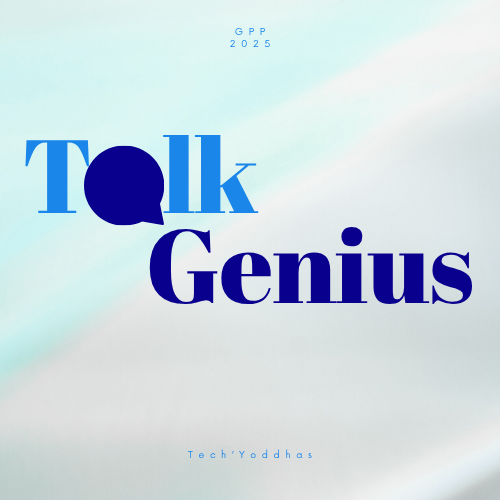

  <!-- Banner Image -->
  
  <h1>TalkGenius</h1>
  <h3>AI that makes you Unstoppable in any Discussion</h3>

  

Have you ever felt nervous before an interview?  
Ever wished you could express your thoughts more clearly or debate with confidence?  
**TalkGenius** is here to change that.  

**TalkGenius** understands that speaking confidently is not just about words, it is about expression, presence, and awareness.  
Our platform helps you **practice, analyze, and master communication** through interactive AI sessions that feel personal, natural, and fun.  

Imagine a virtual coach who listens, observes, and gives you instant, meaningful feedback.  

That is TalkGenius. Our project is designed to help individuals **speak smarter, perform better, and communicate confidently** using the power of **AI and real-time feedback**.  
Whether it’s a mock interview, debate, or personal speaking practice, TalkGenius listens, observes, analyzes, and helps you improve instantly.

 

<!-- Logo Image -->
  

---

## Features 

**Practice Mirror**  
Speak freely and instantly see how your posture, tone, and eye contact are doing.  

**AI Roleplay**  
Enter live interview simulations, face judges, and see how you perform.  

**Inspiration Analyzer**  
Analyze how your favorite speakers speak. Compare your style and grow from there.  

**Debate Mode**  
Engage with our AI in debate mode. Earn points for logic, clarity, and confidence.  

**Gamified Learning Experience**  
Turn practice into play. Earn rewards, track milestones, and stay motivated.  

**What we analyze in every session**  
Eye contact, posture, clarity of voice, filler words, repeated phrases, and your confidence level.  
Every session ends with clear insights and steps you can act on immediately.  

---

## TechStack  

**Frontend:** React, HTML, CSS, Tailwind  
**Backend:** Python (Flask), Node.js, Express.js  
**Others:** Gemini, Mediapipe, Hugging Face, Speech & Video Analysis  

---

## Team  

1. **Mohite Swaraj Sanjay**  
2. **Nalawade Sarthak Balu**  
3. **Nale Nikita Bandu**  
4. **More Siddhi Yuvraj**  

---

## Feedback and Support  

Your feedback helps us grow!  
Please share your valuable feedback at **swarajmohite16@gmail.com**.  
Don’t forget to **star this repository** if you liked the project.

---

  <b>Talk Smart. Think Fast. Be Unstoppable.</b>

